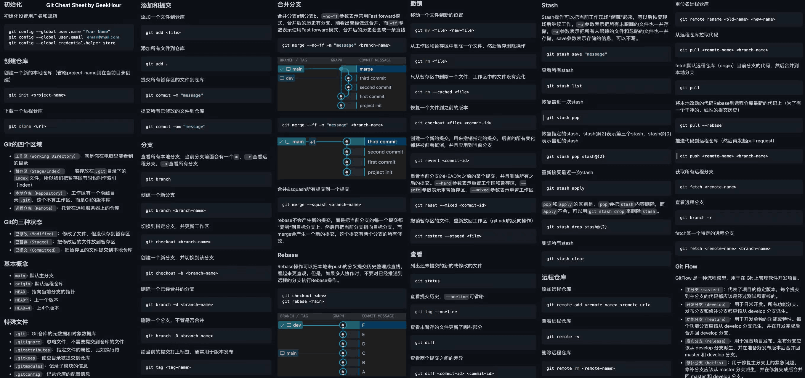

<!--  -->

## 如果 GitHub 远程是没有提交的空仓库

```bash
git init
git add -A
git commit -m "🔄️ init:初始化 main 源码分支"
git checkout -b main
```

然后再绑定哦。

## 绑定本地仓库到你已有的 GitHub 远程仓库

先把本地和远程仓库建立连接，<kbd>Ctrl+Shift+`</kbd>调出 VS code 终端直接执行：

```bash
git remote add origin https://github.com/你的用户名/仓库名.git
```

**验证绑定成功**：

```bash
git remote -v
```

终端输出下面这样，就代表绑定成功：

```bash
origin  git@github.com:xxx/xxx.git (fetch)
origin  git@github.com:xxx/xxx.git (push)
```


报错 `fatal: remote origin already exists`：说明之前绑过别的，先执行 `git remote remove origin` 解除绑定，再重新执行上面绑定命令即可。


## 拉取远程旧 main 分支内容，做安全备份（如果你的仓库原来有 main 分支，可选）

远程  全是旧的  文件，我们先把它拉到本地，备份成一个旧分支，绝对不覆盖本地源码，全程安全兜底。

```bash
git fetch origin
git branch old-main origin/main
```

执行完，你本地就多了一个  备份分支，以前手动上传的所有文件全部永久保留，后续操作完全不会动它。

## 重置本地 main 分支为纯净源码分支

你的 `.gitignore` 已经写好了 `dist`，会自动忽略打包文件夹，不会把 `dist` 提交到  分支。

```bash
git checkout main
git add .
git commit -m "🔄️ init:初始化 main 源码分支" 
```

## 推送全新源码 main 分支

如果  分支已经有冲突文件：

```bash
git push -f origin main
```

否则：

```bash
git push origin main
```

GitHub 远程  分支：已经全部是你的项目源码，`dist` 文件夹被 .gitignore 自动忽略，完全不会上传到 ！

***

## 新建 gh-pages 分支，只存放静态文件

这一步专门创建部署分支，全程独立，和  分支完全隔离，只存放打包后的 `dist` 静态文件。

```bash
pnpm build
cd dist && git init && git add . && git commit -m "init gh-pages" && git push -f git@github.com:你的用户名/仓库名.git HEAD:gh-pages && cd ..
```

GitHub 远程  分支：里面只有 `dist` 静态网页文件，无任何源码，专门用于 GitHub Pages 网站部署。

***

## 日常开发

你以后每次修改完代码，更新网页，只需要严格按这个顺序走，再也不用手动上传文件：

### Vite 项目

#### 1. 开发修改源码（全程在 main 分支）

你改完源码后，更新到 GitHub 源码仓库：

```bash
git add .
git commit -m "✨ Update: 更新源码"
git push origin main
```

#### 2. 打包生成最新的 dist 文件

在 main 分支终端执行打包命令（根据你的项目，你的是 vite 项目）

```bash
npm run build
# 或 pnpm build
```

执行完，本地 `dist` 文件夹就会更新为最新打包文件。


回到主项目根目录，执行这 2 条全局 git 配置，永久关闭这个烦人的换行符警告：

```bash
git config core.autocrlf true
git config core.safecrlf false
```



#### 3. 一键更新 gh-pages 部署网页

```bash
npm run build
# 或 pnpm build
cd dist && git init && git add . && git commit -m "update site" && git push -f git@github.com:你的用户名/你的仓库名.git HEAD:gh-pages && cd ..
```

- 打包最新静态文件
- 一键纯净推送 gh-pages，无任何多余文件

### NextJs 项目

#### 每次写完代码 $\to$ 推源码（main）

<kbd>Ctrl+Shift+`</kbd> 打开终端，直接运行：

```bash
git add .
git commit -m "更新项目源码"
git push origin main
```


把你的代码推送到小号  的  分支（你已经配置好锁死小号，直接推就行）



### 要发布网页 $\to$ 推静态文件（gh-pages）

还是在根目录，直接复制这一条完整命令运行：

```bash
npm run build && cd out && git add . && git commit -m "更新网页" && git push -f https://ru-sin@github.com/ru-sin/用户名.git HEAD:gh-pages && cd ..
```


这条命令会自动

- 打包生成最新 `out`
- 提交网页文件
- 强制推送到小号  分支
- 退回根目录


***

## 高级做法（2 选 1）

### 推送 main 源码后自动推送 gh-pages 分支

访问 /settings/actions，下滑找到 `Workflow permissions`，勾选 Read and write permissions，点击 `Save` 就好了。

 分支新建 `.github/workflows/deploy.yml`，直接复制代码如下：

```yml
name: 自动部署到 gh-pages

on:
  push:
    branches:
      - main  # 推送到 main 分支就自动触发

jobs:
  deploy:
    runs-on: ubuntu-latest
    steps:
      - name: 拉取代码
        uses: actions/checkout@v4
        with:
          persist-credentials: false

      - name: 安装依赖
        run: npm install

      - name: 编译生成 out 文件夹
        run: npm run build

      - name: 部署到 gh-pages
        uses: peaceiris/actions-gh-pages@v4
        with:
          github_token: ${{ secrets.GITHUB_TOKEN }}
          publish_dir: ./out
```

这样就不需要推静态文件（）分支了，直接推  即可。

### build 后一行命令部署 dist

安装工具。

```bash
npm install gh-pages --save-dev
```

在 `package.json` 里添加部署脚本。

```json
{
  "scripts": {
    "deploy": "gh-pages -d dist"
  }
}
```

部署命令，可以自动部署到 gh-pages 分支。

```bash
npm run build
npm run deploy
```

成功！
